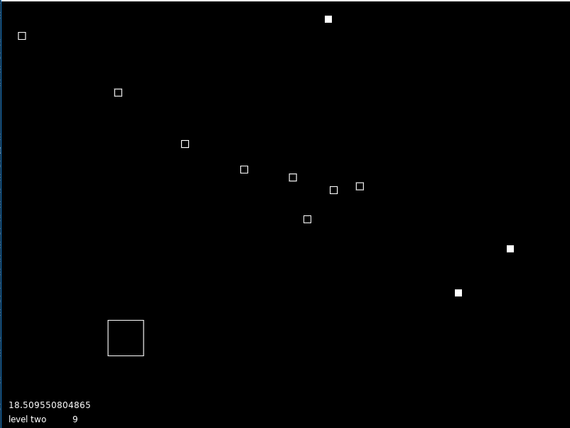
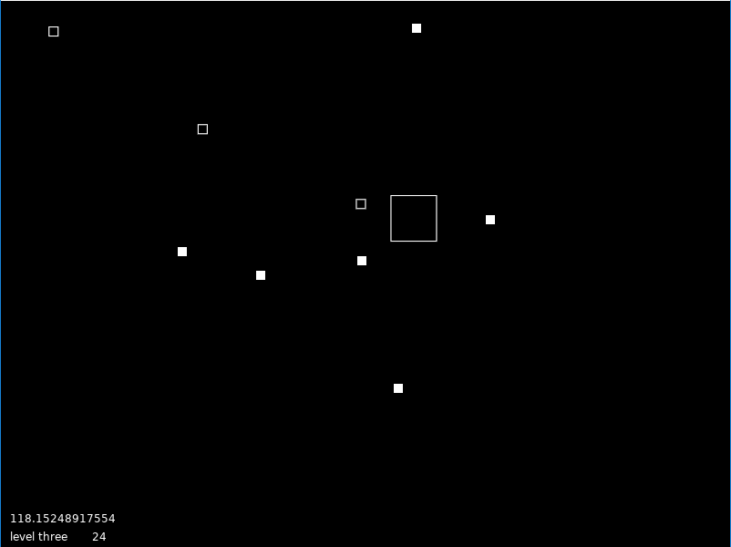

# Can't Keep It Down

This is a really basic game created with the [LOVE 2D engine](https://love2d.org/).

## Dependencies

To run it you will need to have the LOVE 2D engine installed and launch the application through a Lua interpreter. You can use an IDE like [ZeroBrane Studio](https://studio.zerobrane.com/), for example.

## Gameplay

The object of the game is to catch as many projectiles coming out of the player while not getting hit by enemies. Catching projectiles will award you points, where as getting hit my enemies will subtract points from your score. There are different levels which can be configured. Levels can be completed in a number of various conditions, such as timed levels, which will persist for a given duration, and scored levels, which will persist until a given score is achieved. Levels will vary by changing the scale of the objects in the game and as you change levels you will notice the speed, spawn intervals, and behaviors of objects changes based on the level configration.

The assets for the game are a work in progress so for now the player is the large outlines square, the enemies are the small outlines squares, and projectiles are the small filled squares.

Here's a sample of the game in progress.

As you can see spawn rates vary level to level, here's another level where projectiles spawn more frequently than enemies

## Player Movement

The player moves via the arrow keys (up, down, left, right), respectively.

## Projectile Movement/Behavior

Projectiles spawn on a given interval, as defined for each level. When a projectile collides with a player the player is provided a speed boost. The speed boost will increase with each successive projectile collision. However, the player's benefit from the projectiles will normally have a speed cap and past a certain point capturing projectiles will no longer provide a speed benefit (but will always reward points).

Projectiles will spawn out of the player randonly from either the left, right, top, or bottom side. Projectiles will wrap along the screen one time. For intance, if it spawns left, once it goes off the screen to the left, it will reappear at the same y position on the right side of the screen. Once a projectile completes this process, the next time it reaches the edge of the screen it will despawn. This means you have 1.5 screen widths or height to capture the projectile before it despawns.

## Enemey Movement/Behavior

Enemies spawn on a given interval, as defined for each level. When a enemy collides with the player the player is deducted points. The player is also slowed by the enemy collision. The speed deduction will continue with each enemy collision. However, there will normally be a speed minimum assigned to the player such that after the player hits a certain slow speed successive enemy collisions will no longet slow the player (but will always deduct points).

Enemies will follow the current position of the player. Where the player goes, the enemies will follow. Enemies will only live for a given duration, which is set on a per-level basis. After the enemy has been on the screen for this duration, it will despawn and can no longer affect the player.

## Structure/Files

The structure of the code is as such:

* _conf.lua_ - contains configuration settings for the game
* _require.lua_ - contains all the required files that are needed for the game
* _main.lua_ - main driver for the game, which contains the `love.load`, `love.update(dt)`, and `love.draw()` lifecycle methods
* _lib/_ - contains all the external libraries needed
    * _classic.lua_ - class module for lua [rxi/classic](https://github.com/rxi/classic). This is used for all the classed in this game
* _src/_ - contains all the source files utilized in the game, basically think class files.
    * _play.lua_ - this is the class which controls how the game operates; it wraps around the love `love.update(dt)` and `love.draw()` lifecycle method, which are called from the _main.lua_ driver
    * _score.lua_ - class represents the game score, contains members: score, point value, point multiplier, whether or not to allow negative, etc.
    * _level.lua_ - class represents a level, contains members like: name, start and end times, player speeds, spawn intervals, point values, point multipliers, etc. Think of each instance of a level as the level configuration, these settings get applied to the objects of the game when the level is loaded.
    * _timed\_level.lua_ - extends _level.lua_ and adds a duration property. It overwrites the `Level:completed()` method, which determines whether or not the completion criteria of the level has been met. For this type of level, it's purely time-based, after playing the level for a given amount of time, it will be completed.
    * _score\_level.lua_ - extends _level.lua_ and adds a score property. It overwrites the `Level:completed()` method, which determines whether or not the completion criteria of the level has beed met. For this type of level, it's score-based in the sense that you need to reach a given score to advance.
    * _timer.lua_ - class represents a timer of sorts. You provide it a start time and interval, and the `Timer:isReady()` method can be called after the interval is passed. This is used for spawn timers in _play.lua_.
    * _variable\_timer.lua_ - extends the _timer.lua_ class, adds a range for the interval and overwrites the `Timer:isReady()` method, which will now be ready at a random time within the given interval range. This is used for cases where you want a non-linear spawn timer.
    * _collision.lua_ - this is the only one that's not truely a class, this is just a helper function that checks if two objects have collided. It's used for all the moveable objects in this game.
    * _mixins_ - mixins for various objects
        * _lifetime.lua_ - class represents the lifetime of an object, which retains the time the object has been alive and implements a `Lifetime:hasLifeExpired(time)` method, which will return whether or not the object's finite lifetime has expired and it should be removed.
        * _moveable.lua_ - class represents anything on the screen that is moveable, as in has a x, and y position, speed, etc. Attaching this to an object provides an easy interface to manipulate the objects position and speed properties.
        * _scaleable.lua_ - class represents any object that can scale it's attributes. In this case the attributes the can scale are the size and speed of a given object. This mixin is applied to all objects which move on the screen such that it provides a shared interface for manipulating the size and speed of all object which implement this mixin.
    * _player.lua_ - represents you, the player! implements the _moveable.lua_ and _scaleable.lua_ mixins, which provide it the ability to move and scale easily via accessors and mutators for such properties. The player itself also contains the `love.update(dt)` and `love.draw()` lifecycle methods, which handle player behaviors (just movement for now) and how the player is drawn.
    * _enemy.lua_ - represents the bad guys! implements the _moveable.lua_ and _scaleable.lua_ mixins, which provide it the ability to move and scale easily via accessors and mutators for such properties. Also implements the _lifetime.lua_ mixin, which gives the enemy a finite lifespan and will terminate the enemy after being on the screen for a given amount of time. The enemy class itself also contains the `love.update(dt)` and `love.draw()` lifecycle methods, which handle enemy behaviors (just follows the player object right now) and how the enemy is drawn.
    * _projectile.lua_ represents the projectiles that come out of the player, which are to be collected by the player. implements the _moveable.lua_ and _scaleable.lua_ mixins, which provide it the ability to move and scale easily via accessors and mutators for such properties. The projectile class itself also contains the `love.update(dt)` and `love.draw()` lifecycle methods, which handle projectile behaviors and how the projectile is drawn.

# Program Execution

* When the game is initially launched, `love.load()` is executed from _main.lua_. This loads all the source files needed for the game as well as creating a new player instance and levels, and then instantiating a new, local `Play` object, which will initalize the game by initializing the score, enemies and projectile contains and spawn timers, and then configuring the values (speed, multipliers, scales) of the player, projectiles, enemies based on the conditions for the current level.
* Next, `love.update(dt)` followed by `love.draw()` is repeated in a loop from _main.lua_.
* `love.update(dt)` calls `Play:update(dt)` in _play.lua_. This method performs the following:
    * check if the level's completion condition has been met, if so it will mark the level completed and load the next level, which will update the player, enemy, and projectile values for the level.
    * check if a new enemy or projectile is ready to spawn and if they are, add them to the list of enemies or projectiles, respectively.
    * check if the player has collided with projectiles or enemies
    * call the `update(dt)` methods of the player and each enemy and projectile object.
* `love.draw()` calls `Play:draw()` in _play.lua_ this prints the current level/timer/score on the screen and then calls the `draw()` method for every object on the screen.

That's it! there's a bit more details than that, but that's the gist of how it all works.

# Contributing

1. Create your own fork
2. Create your feature branch `git checkout -b my-new-feature`
3. Do your thing and make it more awesome!
4. Commit your changes `git commit -am 'Added some feature'`
5. Push to the branch `git push origin my-new-feature`
6. Create new Pull Request
7. Wait for me to get back to you with a warm thank you for being the best!
